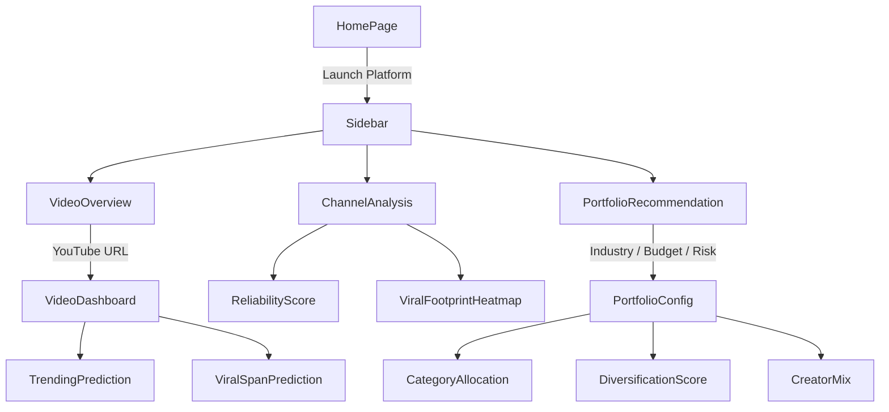

## Dashboard lay out

### VideoDashboard
Get information from `video_id`, using Youtube API
- Current view
- Publish date
- Primary category 

#### TrendingPrediction
Classification of whether a video is **currently** being trendy
- Range: 0-1
- Model ccuracy: 78%

#### ViralSpanPrediction
Estimate the expected number of days until that video goes viral
**Given that** the video is not viral yet
- Type: Confident interval

### ChannelAnalysis
Get information from `channel_id` (extracted from `video_id`), using Youtube API
- Channel origin (can be `NaN`)
- Total subscribers
- Total views

#### ReliabilityScore
Estimate how reliability a channel can make a viral video
Arguments:
- Total subscribers
- Total views
- Total videos

#### ViralFootprintHeatmap
For the video's `category`, get the top 5 countries with the most total `views` from videos with that `category`
Display in bar chart

